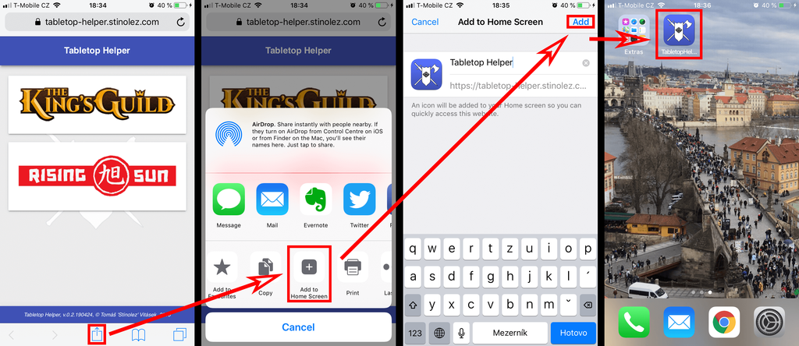
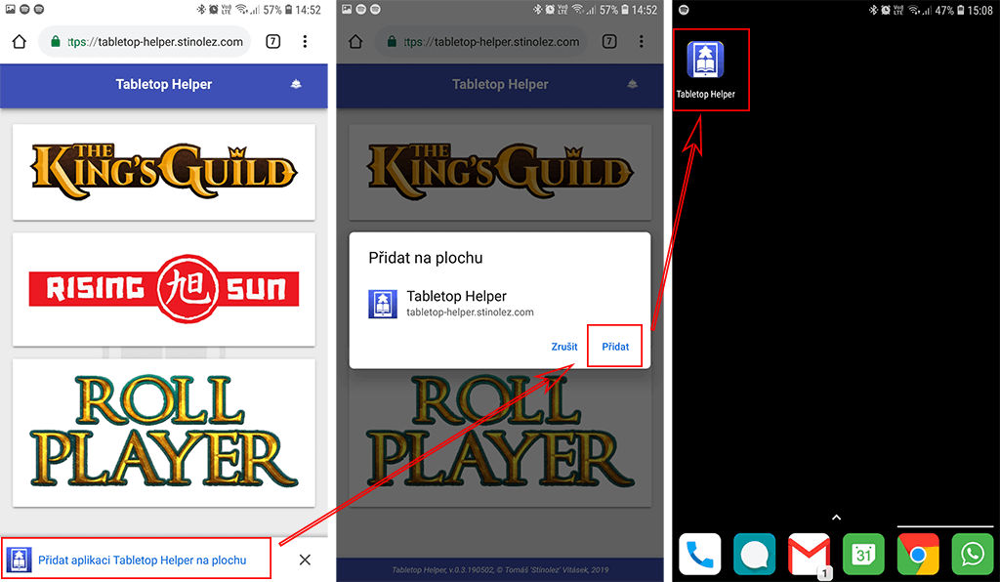

# Tabletop Helper
This project is an companion application for board games. It's designed for mobile use, where all data and objects should be cached on your device, so it should work without using the Internet.

The application is hosted and free to use at my website: <https://tabletop-helper.stinolez.com>

## List of supported board games

* **Imperial Settlers** - <https://boardgamegeek.com/boardgame/154203/imperial-settlers>
* **King's Guild** - <https://boardgamegeek.com/boardgame/206327/kings-guild>
* **Rising Sun** - <https://boardgamegeek.com/boardgame/205896/rising-sun>
* **Roll Player** - <https://boardgamegeek.com/boardgame/169426/roll-player>

*Note: This is my passion project, developed by single developer, who has also a normal job. If you want to see some game featured in the application, please see the feature / game request section below. I've started the project as a way to help us pick random clans for the game Rising Sun - as clans sheets are both-sided and clan markers are in the clan colors which we remember, so we'd be able to pick the clan we like the most and fit the most to our playstyle. I'll expand the list of supported games slowly through out the time, featuring the games you request, preferring the ones which we also have in collection.*

## How to install this application

### iPhone / iPad
To install this application on your iPhone / iPad, just follow few basic steps:
1. Tap the Share button in Safari
2. Tap the icon labeled Add to Home Screen.
3. Name your application, then tap Add in the upper-right corner.
4. Now you can launch the application from your home screen by tapping the icon.

*Note:  The application can be deleted the same way any native app is removed from the Home screen: tap and hold until the icons start jiggling like they’re doing a dance, then tap the little “x” in the top-left corner of the icon.*

### Android
It's little bit easier to install this application on your Android phone or tablet:
1. Visit the page <https://tabletop-helper.stinolez.com> and tap the: Add application Tabletop Helper on Home screen.
2. Tap the Add button.
3. Now you can launch the application from your home screen by tapping the icon.

*Alternatively if the automatic add to home screen is not available, you can add it manually like:*
1. *Tap the Setting button in Google Chrome.*
2. *Tap the icon labeled Add to Home Screen.*
3. *Name your application, then tap Add button.*
4. *Now you can launch the application from your home screen by tapping the icon.*

## Feature / game request
Do you have board game you'd like to see in this companion application or some functionality for already present board game is missing? If so, please submit feature request via the **Feature request template** in the Issues tab.

## Bug report
If you have any issue with this application, please submit it via the **Bug report template** in the Issues tab.
Please see if there was already submitted another bug similar to yours to avoid creating duplicates. I also recommend to try restart the application at first (swipe it out, kill from task manager) and try to restart it. Another trick, which might solve some major issues - esp. when update was not delivered - go to your browser setting and try to delete data from the domain <https://stinolez.com>.

## Credits

* All game assets (incl. logos) are property of their respective owners.
* Guild images for *King's Guild* by Laura Bevon (<http://www.laurabevon.com/>)
* Icons by <https://game-icons.net/>
